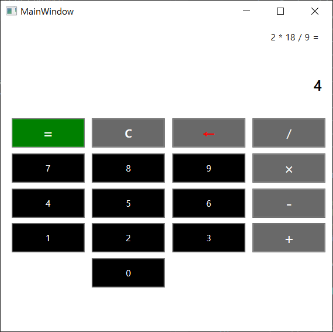

# Custom-Calc

간단한 Windows용 계산기 (C#, XAML 기반)

## 개발 환경

* Visual Studio 2019

## 기능

* 사칙연산 (덧셈, 뺄셈, 곱셈, 나눗셈)
* 입력값 삭제 (Backspace)
* 연산 초기화 (Clear)

## 주요 파일

| 파일명 | 역할 |
|-----|-----|
| MainWindow.xaml | UI 코드 |
| MainWindow.xaml.cs | UI 인터랙션 로직 코드 |
| custom-calc.sln | VS 솔루션 |

## 스크린샷

 

